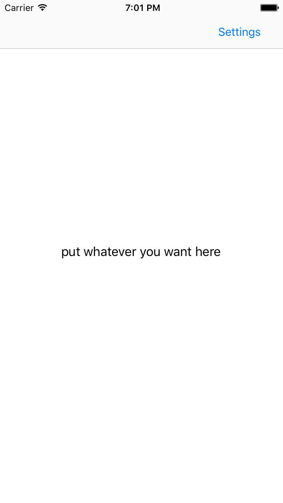
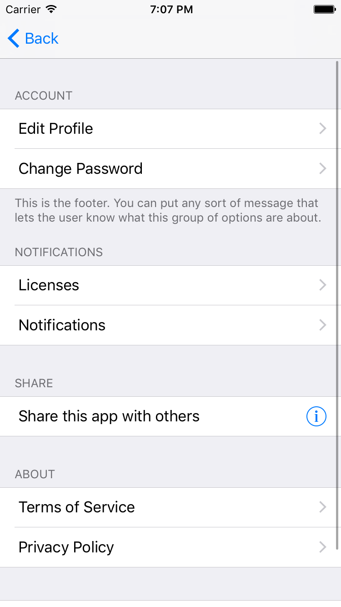
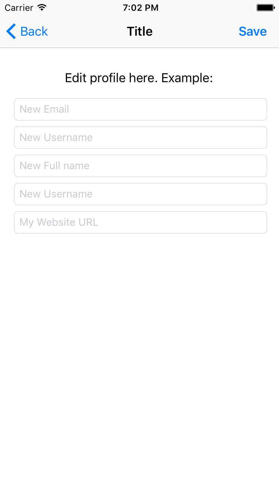

# SettingsPage

A Simple example of a Settings Page. Most apps have some sort of settings page, although with varying layouts and designs. 
No code is used in this demo, only UI elements from the Main.Storyboard.

This demo uses a UITableViewController with static cells as opposed to the usual prototype cells with reuse identifiers. 
Each 'group' of cells is known as a section. Each section can have as many option cells as you would like. Each section may
also have a header and footer for displaying any text desired. 

For reference, take a look at a popular app such as Twitter. Twitter's settings page uses headers above each section to make
it clear what each group is generally about. Additionally, you may use the footer field to add a slightly more detailed description
at a smaller text size.

